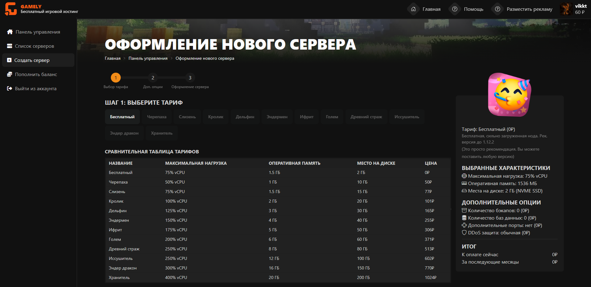

# Создание сервера

<figure><figcaption></figcaption></figure>

На первом шагу вы выбираете тариф для вашего сервера. Тарифы переключаются с помощью кнопок в центре страницы. Справа, в отдельном окне вы будете видеть характеристики и цену будущего сервера. Вы можете улучшить уже созданный тариф. Откатить тариф на более слабый нельзя. \
\
После нажатия кнопки продолжить, вы перейдёте к второму шагу.

<figure><figcaption></figcaption></figure>

Здесь вы выбираете нужное вам количество бэкапов, баз данных и дополнительных портов. У вас всегда есть один порт по умолчанию.\
\
Бэкапы нужны для сохранения резервной копии сервера. На Donator тарифах они хранятся 30 дней, после чего удаляются. На Game тарифах они хранятся 90 дней. Бэкапы сохраняют абсолютно все файлы сервера, а не только мир.\
\
Базы данных нужны для синхронизации информации между различными сервисами или серверами. Они могут использоваться множеством плагинов: AuthMe, CoreProtect, LimboAuth и другими. В базе данных можно разрешить подключение только с определённых IP и сгенерировать новый пароль. Базы данных доступны только в формате MySQL - учитывайте это при их покупке.\
\
Порты нужны для возможности подключения сервера к различным ресурсам (EasyDonate, например) или добавления новых функций: Онлайн-карта сервера (DynMap), голосовой чат (PlasmoVoice), заход с телефона (GeyserMC).\
\
Все эти ресурсы при желании можно докупить уже после покупки сервера. Отменить купленные ресурсы нельзя.\
\
После нажатия кнопки продолжить, вы перейдёте к третьему, финальному шагу.

<figure><figcaption></figcaption></figure>

На третьем шагу вы вписываете название вашего сервера. Оно будет отображаться в списке ваших серверов и его можно будет изменить позже. \
\
После этого вы можете ввести промокод на создание сервера. Они как правило публикуются в новостях на Discord сервере и в Telegramm. Промокоды действуют ограниченное количество времени и дают скидку на покупку сервера.\
\
Уровень ДДОС защиты влияет на то, на каких нодах будет размещён ваш сервер. Для обычной защиты Donator-ноды, для расширенной защиты отдельные Game-ноды. ДДОС защита защищает только от пакетных атак, она не защищает вас от бот-атак. Подключение расширенной защиты увеличивает цену сервера на 25%. \
\
После этого вы обязаны согласиться с офертой. Если у вас достаточно денег на балансе, но сервер будет успешно создан, а с вашего баланса спишется сумма на его покупку.
